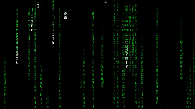

# Matrix Falling Code in Rust

This is an implementation of the Matrix falling code effect in Rust.

I built this primarily as a practice project to improve my Rust skills, so it's not perfect—but it works!

